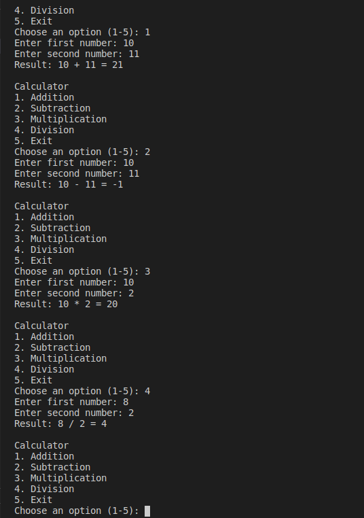

# Python Calculator

## Student Information
- **Student Name:** Alvarado, Sebastian Joaquin S.
- **Course:** S-ITNT415
- **Section:** BIT41

## Project Description
This project is a menu-driven Python calculator developed using
Git and GitHub. Each arithmetic operation was developed on a
separate feature branch and integrated into main through a pull request.

## Branch Structure
- `main` — Integrated calculator application.
- `addition_YourLastName` — Addition implementation.
- `subtraction_YourLastName` — Subtraction implementation.
- `multiplication_YourLastName` — Multiplication implementation.
- `division_YourLastName` — Division implementation.

## Program Features
- Addition, subtraction, multiplication, and division.
- Menu-driven interface.
- Validation of menu choices and numeric input.
- Division-by-zero handling.
- Continuous execution until the user selects Exit.
- Separate functions for each arithmetic operation.
- Automated tests for subtraction, multiplication, and division.

## How to Run
With Python 3 installed, open a terminal in the project folder and run:

    python3 calculator.py

On Windows, you can use:

    py calculator.py

To run the automated tests:

    python3 -m unittest -v

## Sample Execution Screenshot

